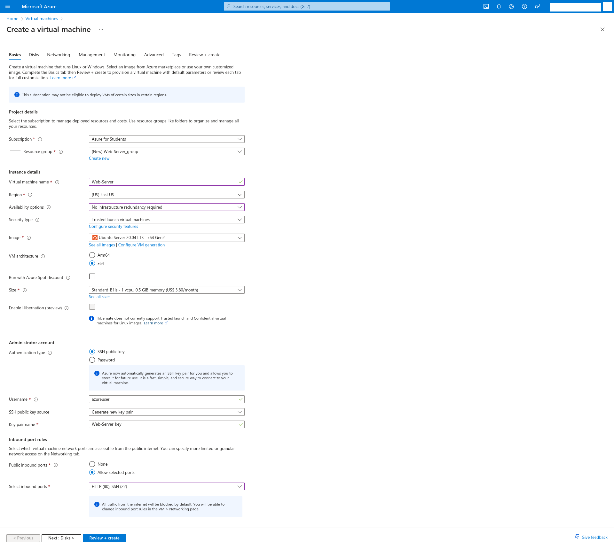
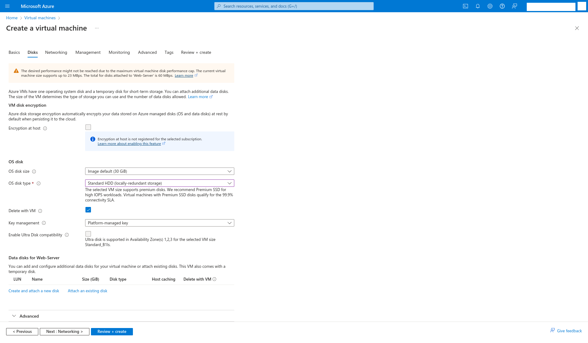
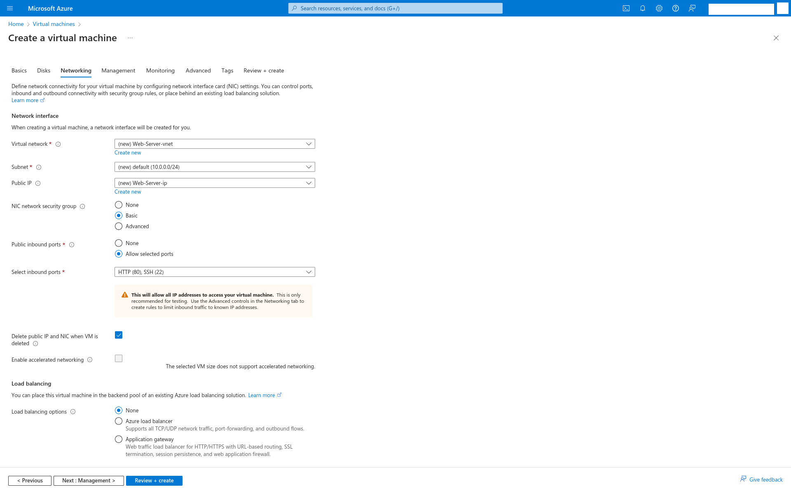
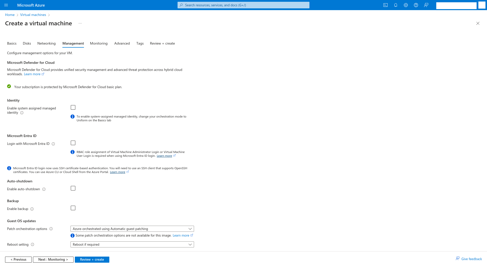
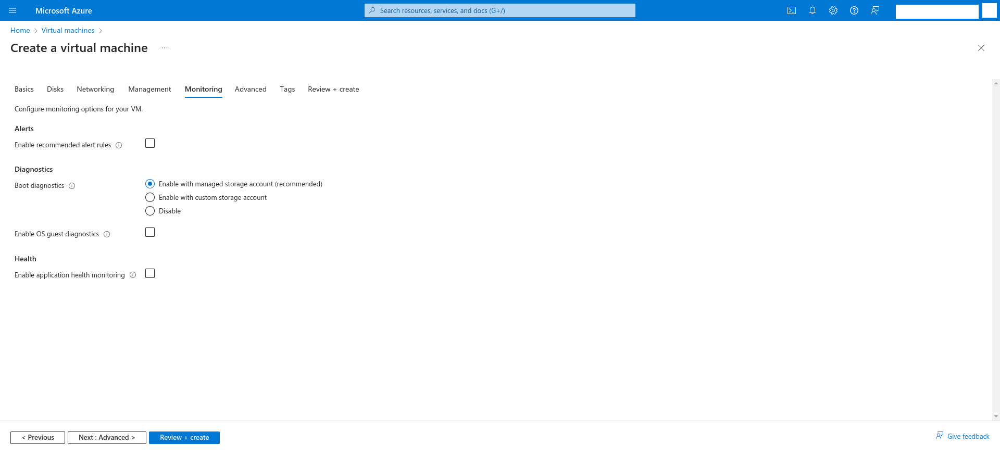
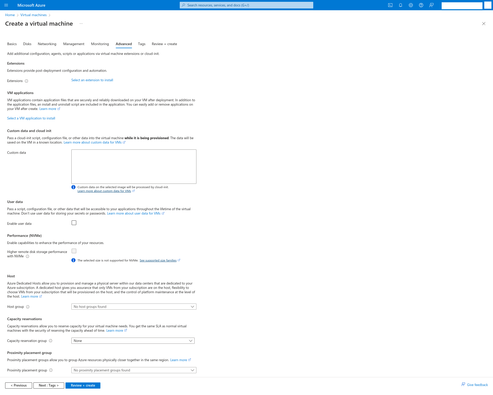
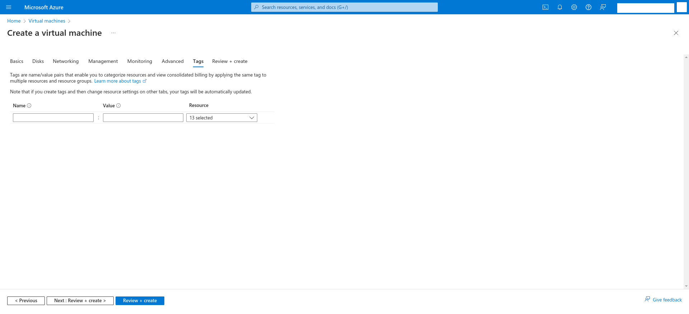
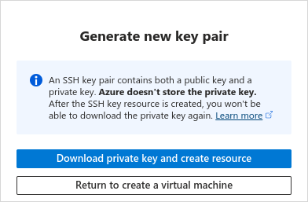
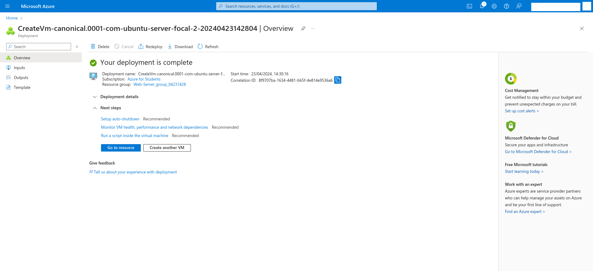

# Laboratório de Criação de Servidor Web no Microsoft Azure

Criação de uma máquina virtual no Microsoft Azure para rodar um servidor web

## Tecnologias utilizadas

<div style="display: flex; gap: 10px;">
    
    
    
</div>

## Onde aplicar

Este projeto pode ser aplicado quando precisamos de um servidor web.

## Roadmap

### STEP 1 - Criação da conta de estudante no Microsoft Azure

O Instituto de Ciências Exatas e Informática (ICEI) da PUC Minas possuí parceria com a Microsoft, dando um crédito de US$100 para cada aluno anualmente. Para criar sua conta de estudante, basta seguir o [tutorial no site do ICEI](https://icei.pucminas.br/index.php/azurepucminas).

### STEP 2 - Criação de uma máquina virtual na Azure

No [console do Microsoft Azure](https://portal.azure.com/), em Azure services, clique em "Virtual machines" (Máquinas Virtuais).

Caso não apareça a opção "Virtual machines", na barra de pesquisa ("Search resources, services, and docs (G+/)"), digite "Virtual machines", e clique na primeira opção.

<p>
<div style="border: 2px solid black; display: block;">
    <div></div>
    <div><span>Tela inicial do Micrsoft Azure</span></div>
</div>
</p>

<p>
<div style="border: 2px solid black; display: block;">
    <div></div>
    <div><span>Opções do Azure services</span></div>
</div>
</p>

<p>
<div style="border: 2px solid black; display: block;">
    <div></div>
    <div><span>Clique em 'Virtual machines'</span></div>
</div>
</p>

No menu "Virtual machines" (Máquinas Virtuais), clique no botão "Create", e depois em "Azure virtual machine".

<p>
<div style="border: 2px solid black; display: block;">
    <div></div>
    <div><span>Menu 'Virtual machines'</span></div>
</div>
</p>

<p>
<div style="border: 2px solid black; display: block;">
    <div></div>
    <div><span>Clique em 'Create'</span></div>
</div>
</p>

<p>
<div style="border: 2px solid black; display: block;">
    <div></div>
    <div><span>Opções de 'Create' em 'Virtual machine'</span></div>
</div>
</p>

<p>
<div style="border: 2px solid black; display: block;">
    <div></div>
    <div><span>Clique em 'Azure virtual machine'</span></div>
</div>
</p>

No menu "Create a virtual machine" (criar uma máquina virtual):

**Instance details (Detalhes de instância)**:

- Em  "Virtual machine name" (nome da máquina virtual), digite: ```Web-Server```.

- Em "Region" (Região), selecione ```(US) East US``` (Leste dos EUA).

- Em "Availability options" (Opções de disponibilidade), selecione ```No infrastructure redundancy required``` (Nenhuma redundância de infraestrutura necessária).

- Em "Image" (Imagem), selecione ```Ubuntu Server 20.04 LTS - x64 Gen2```.

- Em "Size" (Tamanho), selecione ```Standard_B1ls - 1 vcpu, 0.5 GiB memory (US$ ????/month)```

**Administrator account (Conta de administrador)**:

- Em "Authentication type" (Tipo de autenticação), selecione ```SSH public key``` (chave pública SSH).

- Em "Username" (Nome de usuário), digite ```azureuser```.

- Em "SSH public key source" (Fonte da chave pública SSH), selecione ```Generate new key pair``` (gere um novo par de chaves).

- Em "Key pair name", digite ```Web-Server_key```.

**Inbound port rules (Regras de portas de entrada)**:

- Em "Public inbound ports" (Portas públicas de entrada), selecione: ```Allow selected ports``` (Permitir portas selecionadas).

- Em "Select inbound ports" (Selecione portas de entrada), selecione: ```HTTP (80)``` e ```SSH (22)```.

<p>
<div style="border: 2px solid black; display: block;">
    <div></div>
    <div><span>Configuração da seção 'Basics' da máquina virtual que será criada</span></div>
</div>
</p>

E clique no botão "Next : Disks >" (Próximo: Discos).

<p>
<div style="border: 2px solid black; display: block;">
    <div></div>
    <div><span>Clique no botão 'Next: Disks'</span></div>
</div>
</p>

**OS disk (Disco de Sistema Operacional)**:

- Em "OS disk type" (tipo de disco de sistema operacional), selecione ```Standard HDD (locally-redundant storage)```.

<p>
<div style="border: 2px solid black; display: block;">
    <div></div>
    <div><span>Configuração da seção 'Disks' da máquina virtual que será criada</span></div>
</div>
</p>

E clique no botão "Next : Networking >" (Próximo: Rede).

<p>
<div style="border: 2px solid black; display: block;">
    <div></div>
    <div><span>Clique no botão "Next : Networking >"</span></div>
</div>
</p>

**Network interface (Interface de rede)**:

- Em "Public IP" (IP Público), selecione ```(new) Web-Server-ip```, caso não exista, clique em "Create new". E uma aba à direita abrirá.

**Create public IP address (Criar endereço IP público)**:

Em "Name", coloque ```Web-Server-ip```.

Em "SKU", selecione "Basic".

Em "Assignment", selecione ```Static``` (Estático).

E clique em "OK".

- Marque a checkbox "Delete public IP and NIC when VM is deleted".

Clique no botão "Next : Management >" (Próximo: Gerenciamento).

<p>
<div style="border: 2px solid black; display: block;">
    <div></div>
    <div><span>Configuração da seção 'Networking' da máquina virtual que será criada</span></div>
</div>
</p>

<p>
<div style="border: 2px solid black; display: block;">
    <div></div>
    <div><span>Clique no botão "Next : Management >"</span></div>
</div>
</p>

Clique no botão "Next : Monitoring >" (Próximo: Monitoramento).

<p>
<div style="border: 2px solid black; display: block;">
    <div></div>
    <div><span>Configuração da seção 'Management' da máquina virtual que será criada</span></div>
</div>
</p>

<p>
<div style="border: 2px solid black; display: block;">
    <div></div>
    <div><span>Clique no botão "Next : Monitoring >"</span></div>
</div>
</p>

Clique no botão "Next : Advanced >" (Próximo: Avançado).

<p>
<div style="border: 2px solid black; display: block;">
    <div></div>
    <div><span>Configuração da seção 'Monitoring' da máquina virtual que será criada</span></div>
</div>
</p>

<p>
<div style="border: 2px solid black; display: block;">
    <div></div>
    <div><span>Clique no botão "Next : Advanced >"</span></div>
</div>
</p>

Clique no botão "Next : Tags >" (Próximo: Tags).

<p>
<div style="border: 2px solid black; display: block;">
    <div></div>
    <div><span>Configuração da seção 'Advanced' da máquina virtual que será criada</span></div>
</div>
</p>

<p>
<div style="border: 2px solid black; display: block;">
    <div></div>
    <div><span>Clique no botão "Next : Tags >"</span></div>
</div>
</p>

Clique no botão "Review + create" (Revisar + Criar).

<p>
<div style="border: 2px solid black; display: block;">
    <div></div>
    <div><span>Configuração da seção 'Tags' da máquina virtual que será criada</span></div>
</div>
</p>

<p>
<div style="border: 2px solid black; display: block;">
    <div></div>
    <div><span>Clique no botão "Review + create"</span></div>
</div>
</p>

Clique no botão "Create" (Criar).

<p>
<div style="border: 2px solid black; display: block;">
    <div></div>
    <div><span>Review da máquina virtual que será criada</span></div>
</div>
</p>

<p>
<div style="border: 2px solid black; display: block;">
    <div></div>
    <div><span>Clique em 'Create'</span></div>
</div>
</p>

Clique no botão "Download private key and create resource" (Baixar chave privada e criar recurso), e salve a chave privada em um diretório de sua preferência.

<p>
<div style="border: 2px solid black; display: block;">
    <div></div>
    <div><span>Caixa de aviso para gerar um par de chaves</span></div>
</div>
</p>

<p>
<div style="border: 2px solid black; display: block;">
    <div></div>
    <div><span>Clique em 'Download private key and create resource'</span></div>
</div>
</p>

Será mostrado a mensagem "Deployment is in progress" (Implantação está em progresso).

Aguarde até aparecer a mensagem "Your deployment is complete" (Sua implantação está completa).

E clique no botão "Go to resource" (Ir para o recurso).

<p>
<div style="border: 2px solid black; display: block;">
    <div></div>
    <div><span>Menu de deployment com mensagem 'Your deployment is complete'</span></div>
</div>
</p>

<p>
<div style="border: 2px solid black; display: block;">
    <div></div>
    <div><span>Clique em 'Go to resource'</span></div>
</div>
</p>

Será mostrada a máquina virtual recém-criada.

<p>
<div style="border: 2px solid black; display: block;">
    <div></div>
    <div><span>Menu Overview da máquina virtual recém-criada</span></div>
</div>
</p>

Nesse menu, em "**Overview**", em "**Essentials**", em "**Public IP address**", copie o endereço IP público para a área de transferênca.

Em um editor de texto de sua preferência, cole esse endereço IP. Em breve ele será utilizado.

### STEP 3 - Instalação do servidor web

Abra uma janela do Terminal (no Windows 10 é o PowerShell).

1. Utilize o comando ```cd``` para mudar de diretório para a pasta onde foi baixado a chave privada:

```
cd <PASTA ONDE FOI BAIXADO A CHAVE PRIVADA>
```

substituindo ```<PASTA ONDE FOI BAIXADO A CHAVE PRIVADA>``` pela pasta onde foi baixado a chave privada.

Exemplo:

```
cd Downloads
```

2. Utilize o comando ```ssh``` para acessar a máquina virtual no Azure:

```
ssh -i <NOME DO ARQUIVO DE CHAVE PRIVADA> <NOME DE USUARIO DA MAQUINA VIRTUAL AZURE>@<ENDEREÇO IP DA MÁQUINA VIRTUAL AZURE>
```

substituindo ```<NOME DO ARQUIVO DE CHAVE PRIVADA>``` pelo nome de arquivo da chave privada da máquina virtual do Azure,

substituindo ```<NOME DE USUARIO DA MAQUINA VIRTUAL AZURE>``` pelo nome de usuário da máquina virtual do Azure,

substituindo ```<ENDEREÇO IP DA MÁQUINA VIRTUAL AZURE>``` pelo endereço IP da máquina virtual do Azure.

O nome de usuário que criamos para a máquina virtual do Azure foi ```azureuser```.

Exemplo:

```
ssh -i ./Web-Server_key.pem azureuser@172.190.229.207
```

Esse é a saida esperada:

```
Welcome to Ubuntu 20.04.6 LTS (GNU/Linux 5.15.0-1060-azure x86_64)

 * Documentation:  https://help.ubuntu.com
 * Management:     https://landscape.canonical.com
 * Support:        https://ubuntu.com/pro

  System information as of Tue Apr 23 18:21:00 UTC 2024

  System load:  0.01              Processes:             100
  Usage of /:   5.2% of 28.89GB   Users logged in:       0
  Memory usage: 63%               IPv4 address for eth0: 10.0.0.4
  Swap usage:   0%


Expanded Security Maintenance for Applications is not enabled.

0 updates can be applied immediately.

Enable ESM Apps to receive additional future security updates.
See https://ubuntu.com/esm or run: sudo pro status


The list of available updates is more than a week old.
To check for new updates run: sudo apt update
New release '22.04.3 LTS' available.
Run 'do-release-upgrade' to upgrade to it.


Last login: Tue Apr 23 18:18:52 2024 from 186.248.79.100
To run a command as administrator (user "root"), use "sudo <command>".
See "man sudo_root" for details.

azureuser@Web-Server:~$
```

3. Na máquina virtual, digite os seguintes comandos:

```
sudo apt update
```

O comando ```sudo apt update``` faz o gerenciador de pacotes APT do Ubuntu obter informações dos pacotes disponíveis para serem instalados.

Essa é a saída esperada:

```
Hit:1 http://azure.archive.ubuntu.com/ubuntu focal InRelease
Get:2 http://azure.archive.ubuntu.com/ubuntu focal-updates InRelease [114 kB]
Get:3 http://azure.archive.ubuntu.com/ubuntu focal-backports InRelease [108 kB]
Get:4 http://azure.archive.ubuntu.com/ubuntu focal-security InRelease [114 kB]
Get:5 http://azure.archive.ubuntu.com/ubuntu focal/universe amd64 Packages [8628 kB]
Get:6 http://azure.archive.ubuntu.com/ubuntu focal/universe Translation-en [5124 kB]
Get:7 http://azure.archive.ubuntu.com/ubuntu focal/universe amd64 c-n-f Metadata [265 kB]
Get:8 http://azure.archive.ubuntu.com/ubuntu focal/multiverse amd64 Packages [144 kB]
Get:9 http://azure.archive.ubuntu.com/ubuntu focal/multiverse Translation-en [104 kB]
Get:10 http://azure.archive.ubuntu.com/ubuntu focal/multiverse amd64 c-n-f Metadata [9136 B]
Get:11 http://azure.archive.ubuntu.com/ubuntu focal-updates/main amd64 Packages [3266 kB]
Get:12 http://azure.archive.ubuntu.com/ubuntu focal-updates/main Translation-en [517 kB]
Get:13 http://azure.archive.ubuntu.com/ubuntu focal-updates/restricted amd64 Packages [2889 kB]
Get:14 http://azure.archive.ubuntu.com/ubuntu focal-updates/restricted Translation-en [403 kB]
Get:15 http://azure.archive.ubuntu.com/ubuntu focal-updates/universe amd64 Packages [1181 kB]
Get:16 http://azure.archive.ubuntu.com/ubuntu focal-updates/universe Translation-en [283 kB]
Get:17 http://azure.archive.ubuntu.com/ubuntu focal-updates/universe amd64 c-n-f Metadata [25.7 kB]
Get:18 http://azure.archive.ubuntu.com/ubuntu focal-updates/multiverse amd64 Packages [26.2 kB]
Get:19 http://azure.archive.ubuntu.com/ubuntu focal-updates/multiverse Translation-en [7880 B]
Get:20 http://azure.archive.ubuntu.com/ubuntu focal-updates/multiverse amd64 c-n-f Metadata [620 B]
Get:21 http://azure.archive.ubuntu.com/ubuntu focal-backports/main amd64 Packages [45.7 kB]
Get:22 http://azure.archive.ubuntu.com/ubuntu focal-backports/main Translation-en [16.3 kB]
Get:23 http://azure.archive.ubuntu.com/ubuntu focal-backports/main amd64 c-n-f Metadata [1420 B]
Get:24 http://azure.archive.ubuntu.com/ubuntu focal-backports/restricted amd64 c-n-f Metadata [116 B]
Get:25 http://azure.archive.ubuntu.com/ubuntu focal-backports/universe amd64 Packages [25.0 kB]
Get:26 http://azure.archive.ubuntu.com/ubuntu focal-backports/universe Translation-en [16.3 kB]
Get:27 http://azure.archive.ubuntu.com/ubuntu focal-backports/universe amd64 c-n-f Metadata [880 B]
Get:28 http://azure.archive.ubuntu.com/ubuntu focal-backports/multiverse amd64 c-n-f Metadata [116 B]
Get:29 http://azure.archive.ubuntu.com/ubuntu focal-security/main amd64 Packages [2890 kB]
Get:30 http://azure.archive.ubuntu.com/ubuntu focal-security/main Translation-en [435 kB]
Get:31 http://azure.archive.ubuntu.com/ubuntu focal-security/restricted amd64 Packages [2772 kB]
Get:32 http://azure.archive.ubuntu.com/ubuntu focal-security/restricted Translation-en [387 kB]
Get:33 http://azure.archive.ubuntu.com/ubuntu focal-security/universe amd64 Packages [956 kB]
Get:34 http://azure.archive.ubuntu.com/ubuntu focal-security/universe Translation-en [201 kB]
Get:35 http://azure.archive.ubuntu.com/ubuntu focal-security/universe amd64 c-n-f Metadata [19.2 kB]
Get:36 http://azure.archive.ubuntu.com/ubuntu focal-security/multiverse amd64 Packages [24.0 kB]
Get:37 http://azure.archive.ubuntu.com/ubuntu focal-security/multiverse Translation-en [5904 B]
Get:38 http://azure.archive.ubuntu.com/ubuntu focal-security/multiverse amd64 c-n-f Metadata [548 B]
Fetched 31.0 MB in 6s (5070 kB/s)
```

```
sudo apt install apache2 -y
```

O comando ```sudo apt install apache2 -y``` faz o gerenciador de pacotes APT do Ubuntu instalar o servidor web Apache.

Essa é a saída esperada:

```
Reading package lists... Done
Building dependency tree       
Reading state information... Done
The following additional packages will be installed:
  apache2-bin apache2-data apache2-utils libapr1 libaprutil1
  libaprutil1-dbd-sqlite3 libaprutil1-ldap libjansson4 liblua5.2-0 ssl-cert
Suggested packages:
  apache2-doc apache2-suexec-pristine | apache2-suexec-custom www-browser
  openssl-blacklist
The following NEW packages will be installed:
  apache2 apache2-bin apache2-data apache2-utils libapr1 libaprutil1
  libaprutil1-dbd-sqlite3 libaprutil1-ldap libjansson4 liblua5.2-0 ssl-cert
0 upgraded, 11 newly installed, 0 to remove and 28 not upgraded.
Need to get 1873 kB of archives.
After this operation, 8118 kB of additional disk space will be used.
Get:1 http://azure.archive.ubuntu.com/ubuntu focal/main amd64 libapr1 amd64 1.6.5-1ubuntu1 [91.4 kB]
Get:2 http://azure.archive.ubuntu.com/ubuntu focal-updates/main amd64 libaprutil1 amd64 1.6.1-4ubuntu2.2 [85.1 kB]
Get:3 http://azure.archive.ubuntu.com/ubuntu focal-updates/main amd64 libaprutil1-dbd-sqlite3 amd64 1.6.1-4ubuntu2.2 [10.5 kB]
Get:4 http://azure.archive.ubuntu.com/ubuntu focal-updates/main amd64 libaprutil1-ldap amd64 1.6.1-4ubuntu2.2 [8752 B]
Get:5 http://azure.archive.ubuntu.com/ubuntu focal/main amd64 libjansson4 amd64 2.12-1build1 [28.9 kB]
Get:6 http://azure.archive.ubuntu.com/ubuntu focal/main amd64 liblua5.2-0 amd64 5.2.4-1.1build3 [106 kB]
Get:7 http://azure.archive.ubuntu.com/ubuntu focal-updates/main amd64 apache2-bin amd64 2.4.41-4ubuntu3.17 [1187 kB]
Get:8 http://azure.archive.ubuntu.com/ubuntu focal-updates/main amd64 apache2-data all 2.4.41-4ubuntu3.17 [158 kB]
Get:9 http://azure.archive.ubuntu.com/ubuntu focal-updates/main amd64 apache2-utils amd64 2.4.41-4ubuntu3.17 [84.1 kB]
Get:10 http://azure.archive.ubuntu.com/ubuntu focal-updates/main amd64 apache2 amd64 2.4.41-4ubuntu3.17 [95.5 kB]
Get:11 http://azure.archive.ubuntu.com/ubuntu focal/main amd64 ssl-cert all 1.0.39 [17.0 kB]
Fetched 1873 kB in 0s (28.0 MB/s)
Preconfiguring packages ...
Selecting previously unselected package libapr1:amd64.
(Reading database ... 58942 files and directories currently installed.)
Preparing to unpack .../00-libapr1_1.6.5-1ubuntu1_amd64.deb ...
Unpacking libapr1:amd64 (1.6.5-1ubuntu1) ...
Selecting previously unselected package libaprutil1:amd64.
Preparing to unpack .../01-libaprutil1_1.6.1-4ubuntu2.2_amd64.deb ...
Unpacking libaprutil1:amd64 (1.6.1-4ubuntu2.2) ...
Selecting previously unselected package libaprutil1-dbd-sqlite3:amd64.
Preparing to unpack .../02-libaprutil1-dbd-sqlite3_1.6.1-4ubuntu2.2_amd64.deb ..
.
Unpacking libaprutil1-dbd-sqlite3:amd64 (1.6.1-4ubuntu2.2) ...
Selecting previously unselected package libaprutil1-ldap:amd64.
Preparing to unpack .../03-libaprutil1-ldap_1.6.1-4ubuntu2.2_amd64.deb ...
Unpacking libaprutil1-ldap:amd64 (1.6.1-4ubuntu2.2) ...
Selecting previously unselected package libjansson4:amd64.
Preparing to unpack .../04-libjansson4_2.12-1build1_amd64.deb ...
Unpacking libjansson4:amd64 (2.12-1build1) ...
Selecting previously unselected package liblua5.2-0:amd64.
Preparing to unpack .../05-liblua5.2-0_5.2.4-1.1build3_amd64.deb ...
Unpacking liblua5.2-0:amd64 (5.2.4-1.1build3) ...
Selecting previously unselected package apache2-bin.
Preparing to unpack .../06-apache2-bin_2.4.41-4ubuntu3.17_amd64.deb ...
Unpacking apache2-bin (2.4.41-4ubuntu3.17) ...
Selecting previously unselected package apache2-data.
Preparing to unpack .../07-apache2-data_2.4.41-4ubuntu3.17_all.deb ...
Unpacking apache2-data (2.4.41-4ubuntu3.17) ...
Selecting previously unselected package apache2-utils.
Preparing to unpack .../08-apache2-utils_2.4.41-4ubuntu3.17_amd64.deb ...
Unpacking apache2-utils (2.4.41-4ubuntu3.17) ...
Selecting previously unselected package apache2.
Preparing to unpack .../09-apache2_2.4.41-4ubuntu3.17_amd64.deb ...
Unpacking apache2 (2.4.41-4ubuntu3.17) ...
Selecting previously unselected package ssl-cert.
Preparing to unpack .../10-ssl-cert_1.0.39_all.deb ...
Unpacking ssl-cert (1.0.39) ...
Setting up libapr1:amd64 (1.6.5-1ubuntu1) ...
Setting up libjansson4:amd64 (2.12-1build1) ...
Setting up ssl-cert (1.0.39) ...
Setting up liblua5.2-0:amd64 (5.2.4-1.1build3) ...
Setting up apache2-data (2.4.41-4ubuntu3.17) ...
Setting up libaprutil1:amd64 (1.6.1-4ubuntu2.2) ...
Setting up libaprutil1-ldap:amd64 (1.6.1-4ubuntu2.2) ...
Setting up libaprutil1-dbd-sqlite3:amd64 (1.6.1-4ubuntu2.2) ...
Setting up apache2-utils (2.4.41-4ubuntu3.17) ...
Setting up apache2-bin (2.4.41-4ubuntu3.17) ...
Setting up apache2 (2.4.41-4ubuntu3.17) ...
Enabling module mpm_event.
Enabling module authz_core.
Enabling module authz_host.
Enabling module authn_core.
Enabling module auth_basic.
Enabling module access_compat.
Enabling module authn_file.
Enabling module authz_user.
Enabling module alias.
Enabling module dir.
Enabling module autoindex.
Enabling module env.
Enabling module mime.
Enabling module negotiation.
Enabling module setenvif.
Enabling module filter.
Enabling module deflate.
Enabling module status.
Enabling module reqtimeout.
Enabling conf charset.
Enabling conf localized-error-pages.
Enabling conf other-vhosts-access-log.
Enabling conf security.
Enabling conf serve-cgi-bin.
Enabling site 000-default.
Created symlink /etc/systemd/system/multi-user.target.wants/apache2.service → /l
ib/systemd/system/apache2.service.
Created symlink /etc/systemd/system/multi-user.target.wants/apache-htcacheclean.
service → /lib/systemd/system/apache-htcacheclean.service.
Processing triggers for ufw (0.36-6ubuntu1.1) ...
Processing triggers for systemd (245.4-4ubuntu3.23) ...
Processing triggers for man-db (2.9.1-1) ...
Processing triggers for libc-bin (2.31-0ubuntu9.14) ...
```

4. Acesse a página web do servidor:

Em um navegador web, na sua barra de endereço, digite:

```
http://<ENDEREÇO IP DA MÁQUINA VIRTUAL AZURE>
```

substituindo ```<ENDEREÇO IP DA MÁQUINA VIRTUAL AZURE>``` pelo endereço IP da máquina virtual do Azure.

<p>
<div style="border: 2px solid black; display: block;">
    <div></div>
    <div><span>Página web padrão do servidor web Apache</span></div>
</div>
</p>

### STEP 4 - **IMPORTANTE** - Pare o servidor web

Para evitar que a máquina virtual do Azure consuma todo o seu crédito (US$100), é importante parar a execução da máquina virtual quando ela não estiver mais sendo utilizada.

No [console do Microsoft Azure](https://portal.azure.com/), em Azure services, clique em "Virtual machines" (Máquinas Virtuais).

Caso não apareça a opção "Virtual machines", na barra de pesquisa ("Search resources, services, and docs (G+/)"), digite "Virtual machines", e clique na primeira opção.

<p>
<div style="border: 2px solid black; display: block;">
    <div></div>
    <div><span>Tela inicial do Micrsoft Azure</span></div>
</div>
</p>

<p>
<div style="border: 2px solid black; display: block;">
    <div></div>
    <div><span>Opções do Azure services</span></div>
</div>
</p>

<p>
<div style="border: 2px solid black; display: block;">
    <div></div>
    <div><span>Clique em 'Virtual machines'</span></div>
</div>
</p>

No menu "Virtual machines" (Máquinas Virtuais), clique na caixa de seleção no canto superior esquerdo. E depois clique no botão "Stop".

<p>
<div style="border: 2px solid black; display: block;">
    <div></div>
    <div><span>Menu 'Virtual machines'</span></div>
</div>
</p>

<p>
<div style="border: 2px solid black; display: block;">
    <div></div>
    <div><span>Menu 'Virtual machines' com a máquina virtual 'Web-Server selecionada'</span></div>
</div>
</p>

<p>
<div style="border: 2px solid black; display: block;">
    <div></div>
    <div><span>Clique em 'Stop'</span></div>
</div>
</p>

Uma caixa de mensagem aparecerá perguntando se deseja parar todas as máquinas virtuais. Clique em 'Yes'.

<p>
<div style="border: 2px solid black; display: block;">
    <div></div>
    <div><span>Caixa de mensagem perguntando se deseja parar todas as máquinas virtuais</span></div>
</div>
</p>

<p>
<div style="border: 2px solid black; display: block;">
    <div></div>
    <div><span>Clique em 'Yes'</span></div>
</div>
</p>

### Solução de problemas

#### Erro: "Warning: Unprotected private key file!"

Caso uma mensagem de erro "Warning: Unprotected private key file!" apareça:

```
@@@@@@@@@@@@@@@@@@@@@@@@@@@@@@@@@@@@@@@@@@@@@@@@@@@@@@@@@@@
@         WARNING: UNPROTECTED PRIVATE KEY FILE!          @
@@@@@@@@@@@@@@@@@@@@@@@@@@@@@@@@@@@@@@@@@@@@@@@@@@@@@@@@@@@
Permissions 0644 for 'Web-Server_key.pem' are too open.
It is required that your private key files are NOT accessible by others.
This private key will be ignored.
Load key "Web-Server_key.pem": bad permissions
azureuser@172.190.229.207: Permission denied (publickey).
```

Digite o seguinte comando:

```
chmod 600 <NOME DO ARQUIVO DE CHAVE PRIVADA>
```

Exemplo:

```
chmod 600 Web-Server_key.pem
```

#### O comando ```apt update``` está demorando demais para finalizar

Na janela do terminal aperte as seguintes teclas:

```Ctrl + C``` ou ```Command + C``` (no Mac).

E digite o comando novamente.

## Contato

Henrique Mendonça Castelar Campos - [henriquemendonacastelar@gmail.com](mailto:henriquemendonacastelar@gmail.com)

GitHub: [github.com/Henriquemcc](https://github.com/Henriquemcc)

## License

Este projeto é licenciado sob a [MIT License](https://mit-license.org/) - veja o arquivo [LICENSE](LICENSE) para mais detalhes.